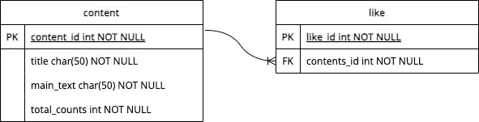

### 개요
- 아루 단기 인턴 과제로 콘텐츠 목록과 상세페이지 조회, 좋아요 기능을 구현하고 화면을 만드는 작업을 진행했습니다.
- 데이터베이스는 AWS RDS 인스턴스에 띄워져 있으나, api는 코드를 통해서만 확인 가능합니다. 혹은 `git clone`을 통해 로컬에서 기능 동작 여부를 확인하실 수 있습니다.
### 개발환경
SpringBoot, AWS RDS - MySQL, Spring data JPA, thymeleaf

### Database ER Diagram

### END-POINT
- `기본 URI` : api.a.com
  - 콘텐츠 리스트 조회 `GET` /library/content
      - skip\[optional] : 제외할 콘텐츠 수
      - limit\[optional] : 가져올 콘텐츠 수
  - 콘텐츠 상세 페이지 조회: `GET` /library/content/{contentId}
  - 좋아요 기능: `POST` /library/content/{contentId}/like

### 과제 진행 후 느낀 점
- 과제 구현 내용은 간단했지만, 개발 전 설계 단계 및 화면단 구현에 예상 외로 많은 시간을 쏟았습니다.
  - 그로 인해 CI/CD 파이프라인 구축, 우대 구현 목록은 미완으로 남겨두었습니다.  
- thymeleaf라는 서버 사이드 렌더링 템플릿 엔진을 사용했는데 가볍고 깔끔하며 스프링부트와 호환성이 있어 편리하다고 느꼈습니다.
  - 다음 번엔 별도의 프론트엔드 서버를 구축, RESTful API 방식으로 화면과 연결하고 싶습니다.
- SSL/HTTPS를 적용해보고 싶습니다.
- 데이터베이스를 AWS EC2에 Docker로 mysql 서버를 구축했었는데, 이번에는 대신 RDS를 사용해보았습니다. 관계형 데이터베이스 전용 인스턴스 서버라서 구축이 편리했습니다.